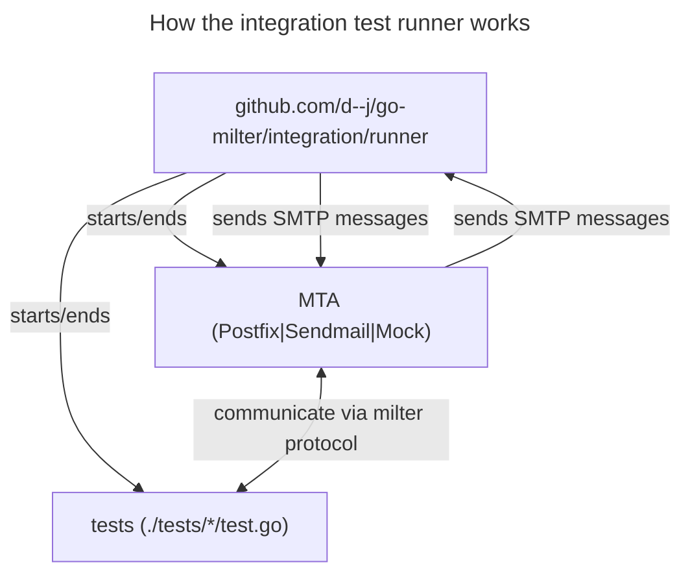

# go-milter integration tests

## How it works

The integration test runner opens a receiving SMTP server and starts test milter servers.
It then configures different MTAs to use the test milter servers and send all emails to the receiving SMTP server (open
relay).
When all this is set up and running, the test runner sends the test cases as SMTP transactions to the MTA and
checks if the right filter decision at the right time was made and whether the outgoing SMTP message is as expected.



## Tests

The integration tests are written in Go and use the `github.com/d--j/go-milter/integration` package.
They are `mailfilter.Mailfilter` or `milter.Milter`s that get fed with test cases.

## Test cases

A test case is one single SMTP connection to an MTA. It can include multiple SMTP transactions.

A test case is a text file in a domain specific language that defines input SMTP commands,
the MTA decision (accept, reject...) and outgoing messages.

One single SMTP transaction looks like this:

```
# <transaction name>
<input steps>
DECISION <decision>[@<step>]
<output>
```

A test case can contain multiple transactions. If it only contains one transaction, the first line
`# <transaction name>` can be omitted.
Your test case of course needs to be a valid SMTP connection conversation. E.g. you can only send the `HELO` command in
the first transaction.

### Input steps

You can omit input steps. Necessary input steps get automatically added to the test case.

#### `HELO [hello-hostname]`

Sends a HELO/EHLO to the SMTP server

#### `STARTTLS`

Start TLS encryption of the connection. Not all MTAs might support this.
You can check if the MTA supports STARTTLS by checking the existence of the `tls-starttls` tag.

#### `AUTH [user1@example.com|user2@example.com]`

Authenticates the SMTP connection. here are only two hard-coded users: `user1@example.com` (password `password1`) and
`user2@example.com` (password `password2`).
Not all MTAs might support this. You can check if the MTA supports STARTTLS by checking the existence of the
`auth-plain` tag.

#### `FROM <addr> args`

Sends a `MAIL FROM` SMTP command.

#### `TO <addr> args`

Sends a `RCPT TO` SMTP command.

#### `RESET`

Sends a `RSET` SMTP command.

#### `HEADER`

Sends the `DATA` SMTP command and then the header. The header to send follows the `HEADER` line. The end of
the header is marked with a single `.` in a line (like in SMTP connections)

#### `BODY`

Sends the body part of the `DATA`. The end of the body part is also marked with a single `.`.

### `DECISION [decision]@[step]`

Every test case needs to have a `DECISION`. Valid decisions are: `ACCEPT`, `TEMPFAIL`, `REJECT`, `DISCARD-OR-QUARANTINE`
and `CUSTOM`.
If you specify `CUSTOM` then the lines after the `DECISION` line get parsed as an SMTP response and the milter should
set this SMTP response.

The `step` can be `HELO`, `FROM`, `TO`, `DATA`, `EOM` and `*`. If the step is omitted `*` is assumed.
`*` means that the decision can happen after any step.

### Output

If you specified `ACCEPT` as decision you can add `FROM`, `TO`, `HEADER` and `BODY` lines (see syntax above) after the
`DECISION` line.
These values get compared with the actual result the MTA send to our receiving SMTP server.

## How to add integration tests to your go-milter based mail filter

You need docker since the test are normally run inside a docker container (where the different MTAs are installed in).

Add a `Makefile`

```makefile
GO_MILTER_INTEGRATION_DIR := $(shell cd integration && go list -f '{{.Dir}}' github.com/d--j/go-milter/integration)

integration:
	docker build -q -t go-milter-integration "$(GO_MILTER_INTEGRATION_DIR)/docker" && \
	docker run --rm -w /usr/src/root/integration -v $(PWD):/usr/src/root go-milter-integration \
	go run github.com/d--j/go-milter/integration/runner -filter '.*' ./tests

.PHONY: integration
```

Add an `integration` directory. Execute the following inside:

```shell
go mod init
go mod edit -require github.com/d--j/go-milter
go mod edit -require github.com/d--j/go-milter/integration
go mod edit -replace $(cd .. && go list '{{.Path}}')=..
mkdir tests
```

Tests consist of a test milter and test cases that get fed into an MTA that is configured to use the test milter.

A test milter can look something like this:

```go
package main

import (
	"context"

	"github.com/d--j/go-milter/integration"
	"github.com/d--j/go-milter/mailfilter"
)

func main() {
	integration.RequiredTags("auth-plain", "auth-no", "tls-starttls", "tls-no")
	integration.Test(func(ctx context.Context, trx mailfilter.Trx) (mailfilter.Decision, error) {
		return mailfilter.CustomErrorResponse(501, "Test"), nil
	}, mailfilter.WithDecisionAt(mailfilter.DecisionAtMailFrom))
}
```

A testcase for this milter would be:

```
DECISION CUSTOM
501 Test
```

You can alternatively use `integration.TestServer` to test your `milter.Milter` implementation.

## How to handle dynamic data

If your milter is time-dependent or relies on external data you can use monkey patching to make the output of your
milter static.
For example, the following sets a constant time for `time.Now` and mocks the SPF checks of your milter to static values:

```go
package patches

import (
	"net"
	"strings"
	"time"

	"blitiri.com.ar/go/spf"
	"github.com/agiledragon/gomonkey/v2"
)

var ConstantDate = time.Date(2023, time.January, 1, 12, 0, 0, 0, time.UTC)

func Apply() *gomonkey.Patches {
	return gomonkey.
		ApplyFuncReturn(time.Now, ConstantDate).
		ApplyFunc(spf.CheckHostWithSender, func(_ net.IP, helo, sender string, _ ...spf.Option) (spf.Result, error) {
			if strings.HasSuffix(sender, "@example.com") || helo == "example.com" {
				return spf.Pass, nil
			}
			if strings.HasSuffix(sender, "@example.net") || helo == "example.net" {
				return spf.Fail, nil
			}
			return spf.None, nil
		})
}
```

The `Received` line that the MTA adds contains dynamic data (date, queue id). Your test milter will see this dynamic
header,
but before comparing the SMTP message with the test case output data the test runner replaces the first
`Recieved` header with the static header `Received: placeholder`.
So you can use `Received: placeholder` as first line of the `HEADERS` section in your testcase to match the dynamic
header.

## Tags & Skipping tests

Your test cases can require certain functionality of the MTA. E.g. that the SMTP connection can use `STARTTLS`.
You can specify these requirements by examining the tags of an MTA before you start the test.

The available tags are:

- `auth-plain`: MTA supports AUTH PLAIN
- `auth-no`: MTA supports sending without AUTH
- `tls-starttls`: MTA supports STARTTLS
- `tls-no`: MTA supports sending without STARTTLS
- `mta-mock`: Identifies the mock MTA
- `mta-postfix`: Identifies the Postfix MTA
- `mta-sendmail`: Identifies the Sendmail MTA
- `exec-foreground`: MTA runs in foreground (internal tag)

You can use `integration.HasTag` to check if a tag is set and use `integration.Skip` to exit your test. E.g.:

```go
package main

import (
	"context"

	"github.com/d--j/go-milter/integration"
	"github.com/d--j/go-milter/mailfilter"
)

func main() {
	if integration.HasTag("mta-sendmail") {
		integration.Skip("this test does not work with Sendmail") // calls os.Exit(integration.ExitSkip)
	}
	// ...
}
```

There is a convenience function `integration.RequiredTags` that checks if all required tags are set. If not, the test is
skipped:

```go
package main

import (
	"context"

	"github.com/d--j/go-milter/integration"
	"github.com/d--j/go-milter/mailfilter"
)

func main() {
	integration.RequiredTags("auth-plain", "auth-no", "tls-starttls", "tls-no")
	integration.Test(func(ctx context.Context, trx mailfilter.Trx) (mailfilter.Decision, error) {
		if trx.Helo().TlsVersion == "" {
			return mailfilter.CustomErrorResponse(500, "No starttls"), nil
		}
		if trx.MailFrom().AuthenticatedUser() == "user1@example.com" {
			return mailfilter.CustomErrorResponse(502, "Ok"), nil
		}
		return mailfilter.CustomErrorResponse(501, "No authentication"), nil
	}, mailfilter.WithDecisionAt(mailfilter.DecisionAtMailFrom))
}

```
